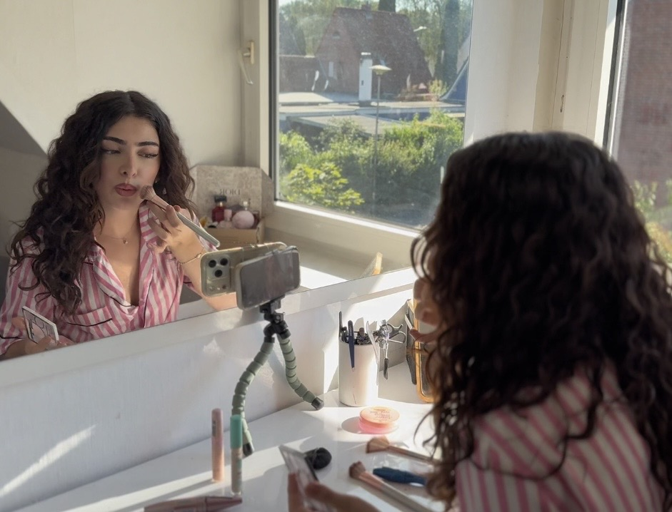
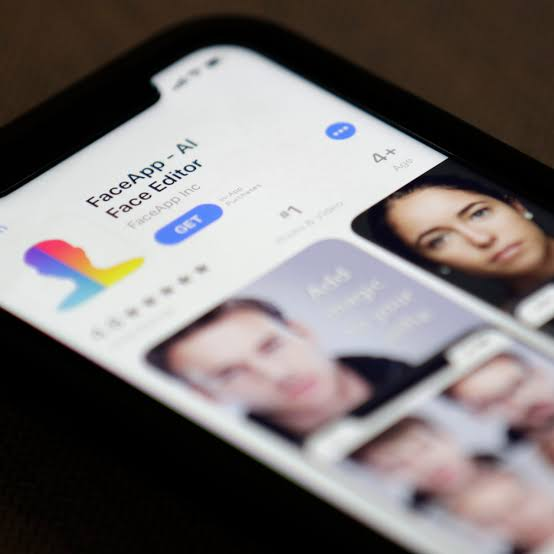

# offcamera.github.io
#  Living Through The Lens

  

<h2 align="center">
  The art of performing for the camera.  
  A life built around attention, creativity and digital identity.
</h2>

---

##  About The Project

**Living Through The Lens** is a creative project about the modern generation that exists through cameras, social media and digital storytelling.

We explore what it means to constantly perform:
-  Creating a version of yourself for the world
-  Living through social media platforms
-  Turning everyday life into content
-  Searching for attention, connection and identity

Is the camera showing who we really are or who we want people to believe we are?

---

# Blog

Follow my thoughts, experiences and stories about performing for the camera.

### Latest Posts

 **The Pressure To Always Be Seen**  
A reflection about living in a world where attention has become a currency.

[Read Blog Post →](blog/pressure-to-always-be-seen.md)

---

#  Short Film

## "Who are We Without the Camera?"

A short film about a person who becomes addicted to creating a perfect online identity.

Watch the full film:

▶️ [Watch Short Film]([)](https://youtu.be/olnWakQ3tzY)

---

#  Featured Youtube Short

Follow the project on TikTok:

[Watch Youtube Short Content →]([)](https://youtube.com/shorts/iHi4xmz68y4?feature=share)

---

## The Impact of Social Media on Mental Health

Research shows that the way we consume social media can influence how we see ourselves.

A meta-analysis examining adolescents found that higher daily social media use was associated with an increased risk of depression. The researchers found that the risk of depressive symptoms increased by approximately 13% for each additional hour spent on social media per day. Compared with lower users, adolescents with higher social media use showed around a 60% higher risk of depression. 

This does not mean that social media directly causes depression. However, constant exposure to carefully edited lifestyles, unrealistic beauty standards and social comparison can influence how people judge themselves and their own lives.

In a world where everyone is performing for the camera, the question becomes:
**Are we watching other people's reality, or are we watching a carefully created version of it?**---

Li, J. B., et al. (2022). Time Spent on Social Media and Risk of Depression in Adolescents: A Dose–Response Meta-Analysis. International Journal of Environmental Research and Public Health.

#  Future Content

Coming soon:

-  More short films
-  Personal blog entries
-  Social media experiments
-  Interviews about digital identity
-  Behind-the-scenes content

---

#  Creator

Created by **Sivana Amedi**

Social Media:
- YouTube: [[]](https://www.youtube.com/channel/UCSIQk-X2Lxa3hY34m9ynlxQ)

---

  <i>
  "We don't just record our lives anymore.  
  We perform them."
  </i>

